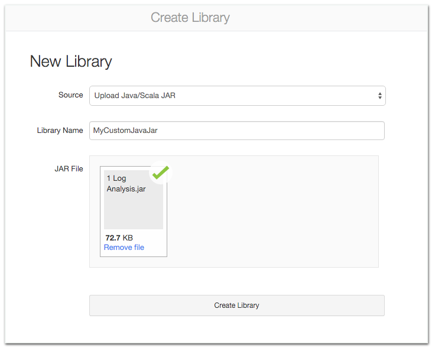

## Create a library
You can create Java, Scala, and Python libraries to run on Spark clusters, or point to external packages in PyPI, Maven, and CRAN. To create a library:

1. Right-click the folder where you want to store the library.
2. Select Create > Library.

## Upload a Java JAR or Scala JAR
In the Source drop-down list, select Upload Java/Scala JAR.

1. Enter a library name.
2. Click and drag your JAR to the JAR File text box.
3. Upload Jar

4. Click Create Library. The library detail screen displays.
5. In the Attach column, select clusters to attach the library to.
6. Optionally select the Attach automatically to all clusters. checkbox and click Confirm.

