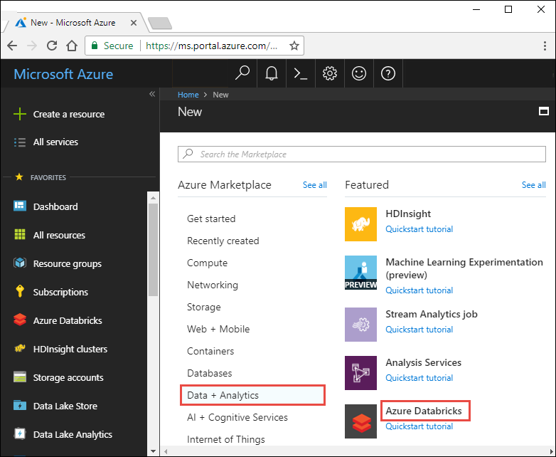
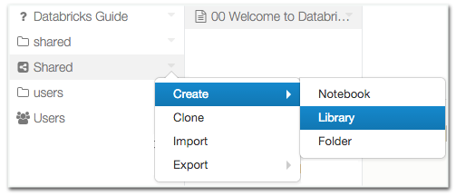

# Lab 10 - Connecting an Apache Spark Cluster to Cosmos DB with Databricks on Azure

## Quickstart: Deploy Azure Databricks using the Azure portal

This quickstart shows how to create an Azure Databricks workspace and an Apache Spark cluster within that workspace. Finally, you learn how to run a Spark job on the Databricks cluster. For more information on Azure Databricks, see [What is Azure Databricks?](what-is-azure-databricks.md)

In this quickstart, as part of the Spark job, you analyze a radio channel subscription data to gain insights into free/paid usage based on demographics. 

If you don't have an Azure subscription, [create a free account](https://azure.microsoft.com/free/) before you begin.

## Log in to the Azure portal

Log in to the [Azure  portal](https://portal.azure.com).

## Create an Azure Databricks workspace

In this section, you create an Azure Databricks workspace using the Azure portal. 

1. In the Azure portal, select **Create a resource** > **Data + Analytics** > **Azure Databricks**. 

    

2. Under **Azure Databricks Service**, provide the values to create a Databricks workspace.

    

    Provide the following values: 
     
    |Property  |Description  |
    |---------|---------|
    |**Workspace name**     | Provide a name for your Databricks workspace        |
    |**Subscription**     | From the drop-down, select your Azure subscription.        |
    |**Resource group**     | Specify whether you want to create a new resource group or use an existing one. A resource group is a container that holds related resources for an Azure solution. For more information, see [Azure Resource Group overview](../azure-resource-manager/resource-group-overview.md). |
    |**Location**     | Select **East US 2**. For other available regions, see [Azure services available by region](https://azure.microsoft.com/regions/services/).        |
    |**Pricing Tier**     |  Choose between **Standard** or **Premium**. For more information on these tiers, see [Databricks pricing page](https://azure.microsoft.com/pricing/details/databricks/).       |

    Select **Pin to dashboard** and then click **Create**.

4. The workspace creation takes a few minutes. During workspace creation, the portal displays the **Submitting deployment for Azure Databricks** tile on the right side. You may need to scroll right on your dashboard to see the tile. There is also a progress bar displayed near the top of the screen. You can watch either area for progress.

    

## Create a Spark cluster in Databricks

> [!NOTE] 
> To use a free account to create the Azure Databricks cluster, before creating the cluster, go to your profile and change your subscription to **pay-as-you-go**. For more information, see [Azure free account](https://azure.microsoft.com/en-us/free/).  

1. In the Azure portal, go to the Databricks workspace that you created, and then click **Launch Workspace**.

2. You are redirected to the Azure Databricks portal. From the portal, click **Cluster**.

    

3. In the **New cluster** page, provide the values to create a cluster.

    

    Accept all other default values other than the following:

    * Enter a name for the cluster.
    * For this article, create a cluster with **4.0** runtime. 
    * Make sure you select the **Terminate after ____ minutes of inactivity** checkbox. Provide a duration (in minutes) to terminate the cluster, if the cluster is not being used.
    
    Select **Create cluster**. Once the cluster is running, you can attach notebooks to the cluster and run Spark jobs. 

For more information on creating clusters, see [Create a Spark cluster in Azure Databricks](https://docs.azuredatabricks.net/user-guide/clusters/create.html).

## Add library files
You can create Java, Scala, and Python libraries to run on Spark clusters, or point to external packages in PyPI, Maven, and CRAN. To create a library:

1. Right-click the folder where you want to store the library.
2. Select Create > Library.

## Upload a Java JAR or Scala JAR
In the Source drop-down list, select Upload Java/Scala JAR.

1. Enter a library name.
2. Click and drag your JAR to the JAR File text box.
3. Upload Jar

4. Click Create Library. The library detail screen displays.
5. In the Attach column, select clusters to attach the library to.
6. Optionally select the Attach automatically to all clusters. checkbox and click Confirm.

7. You will need to add the following two libraries to your Databricks Account:
- [Azure Cosmos Spark Connect for Spark 2.3.0-2.11.2](../helper_files/java_libraries/azure-cosmosdb-spark_2.3.0_2.11-1.2.2-uber.jar)
- [Graphframes](../helper_files/java_libraries/graphframes-0.6.0-spark2.3-s_2.11.jar)

8. You will need to attach these libraries to every cluster

## Importing NoteBooks
Databricks comes included with a version of Jupyter Notebooks, which allows you to write code to run your calculations as well as inline notes.  You can run workloads in R, SQL, Python and Scala.

Import the following notebook into your Databricks Account:
- [cosmos-lab-notebook](./cosmos-lab-notebook.scala)